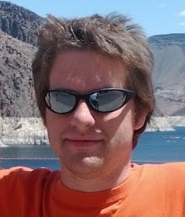

{:width="150" border="5" align="right"}

## Work Experience

#### Postdoctoral Research Associate (2016 - 2017)  
*National Institute of Standards and Technology/University of Maryland* -
Continuation of graduate school research: worked at the Center for Nanoscale Science and Technology on electron transfer processes in sensing, catalysis, and nanoelectronics, as well as developed computational methodology for complex systems.

#### Graduate Student Researcher (2015 - 2016)
*National Institute of Standards and Technology/University of Maryland* -
Worked at the Center for Nanoscale Science and Technology on electron transfer processes in sensing, catalysis, and nanoelectronics, as well as developed computational methodology for complex systems.

#### Graduate Research Assistant (2011 - 2015)
*Oregon State University* -
Investigations of dynamics of quantum systems: fermionic transport in interacting systems, numerical methods of time evolution (time-dependent density matrix renormalization group [tDMRG], matrix product states), open quantum systems, quantum to classical transitions in non-equilibrium steady states.

#### Teaching Assistant (2010 - 2015)
*Oregon State University* -
Teaching assistant for a broad range of physics courses: general physics with and without calculus, upper division programs, online-based astronomy sequence, and graduate level solid state physics.

## Publications

Please check my [Google Scholar](http://scholar.google.com/citations?user=ojlhWVkAAAAJ&amp;hl=en) page for an updated and sortable list of publications.

### Papers

D. Gruss, C.C. Chien, J. Barreiro, M. Di Ventra, and M. Zwolak. An energy-resolved atomic scanning probe,  
[_New J. Phys._ **20** (2018) 115005](https://iopscience.iop.org/article/10.1088/1367-2630/aaedcf/meta),
[arXiv preprint arXiv:1610.01903](http://arxiv.org/abs/1610.01903)

D. Gruss, A. Smolyanitsky, and M. Zwolak. Graphene deflectometry for sensing molecular processes at the nanoscale,  
[arXiv preprint arXiv:1804.02701](https://arxiv.org/abs/1804.02701)

J. Elenewski, D. Gruss, and M. Zwolak, Communication: Master equations for electron transport: The limits of the Markovian limit,  
[_J. Chem. Phys._ **147**, 151101 (2017)](https://aip.scitation.org/doi/abs/10.1063/1.5000747),
[arXiv preprint arXiv:1705.00566](https://arxiv.org/abs/1705.00566)

D. Gruss, A. Smolyanitsky, and M. Zwolak. Communication: Relaxation-limited electronic currents in extended reservoir simulations,  
[_J. Chem. Phys._ **147**, 141102 (2017)](https://aip.scitation.org/doi/abs/10.1063/1.4997022),
[arXiv preprint arXiv:1707.06650](https://arxiv.org/abs/1707.06650)

D. Gruss, K. A. Velizhanin, and M. Zwolak. Landauer's formula with finite-time relaxation: Kramers' crossover in electronic transport,  
[_Sci. Rep._ **6**, 24514 (2016)](http://www.nature.com/articles/srep24514),
[arXiv preprint arXiv:1604.02962](http://arxiv.org/abs/1604.02962)

C.C. Chien, D. Gruss, M. Di Ventra, and M. Zwolak. Interaction-induced conducting-nonconducting transition of ultra-cold atoms in 1d optical lattices,  
[_New J. Phys._ **15** (2013) 063026](http://stacks.iop.org/1367-2630/15/063026),
[arXiv preprint arXiv:1203.5094](http://arxiv.org/abs/1203.5094v2)

### Thesis

Doctoral Dissertation: Quantum and Classical Simulation of Electronic Transport at the Nanoscale  
[ScholarsArchive@OSU](http://hdl.handle.net/1957/59108), [PDF](./assets/papers/GrussDanielS2016.pdf), 2016.

Honors Undergraduate Thesis: Applied Computing Techniques for Holographic Optical Tweezers  
[OSU Library Collections](http://ir.library.oregonstate.edu/xmlui/bitstream/handle/1957/17625/Full%20ThesisGruss.pdf), 2010.

### Presentations

* APS March Meeting 2016 - [A24.00006](http://meetings.aps.org/Meeting/MAR16/Session/A24.6)
* APS March Meeting 2014 - [Y35.00010](http://meetings.aps.org/Meeting/MAR14/Event/216394)
* APS March Meeting 2013 - [B41.00009](./assets/presentations/apsmarch2013.pdf)

## Research

Zwolak Research Group

## Education

#### Oregon State University, Fall 2010 - Spring 2016

College of Science, Doctor of Philosophy Physics

#### Oregon State University, Winter 2007 - Spring 2010

College of Science, H.B.S. Computational Physics, H.B.S. Physics (Applied Option),  
College of Engineering, H.B.S. Engineering Physics,  
Computer Science Minor, Summa Cum Laude,

## Teaching

* Spring 2015 - [Physics 205](http://catalog.oregonstate.edu/CourseDetail.aspx?subjectcode=PH&coursenumber=205)/[206](http://catalog.oregonstate.edu/CourseDetail.aspx?subjectcode=PH&coursenumber=206)/[207](http://catalog.oregonstate.edu/CourseDetail.aspx?subjectcode=PH&coursenumber=207)
* Winter 2015 - [Physics 205](http://catalog.oregonstate.edu/CourseDetail.aspx?subjectcode=PH&coursenumber=205)/[206](http://catalog.oregonstate.edu/CourseDetail.aspx?subjectcode=PH&coursenumber=206)/[207](http://catalog.oregonstate.edu/CourseDetail.aspx?subjectcode=PH&coursenumber=207)
* Fall 2014 - [Physics 205](http://catalog.oregonstate.edu/CourseDetail.aspx?subjectcode=PH&coursenumber=205)/[206](http://catalog.oregonstate.edu/CourseDetail.aspx?subjectcode=PH&coursenumber=206)
* Summer 2014 - [Physics 201](http://physics.oregonstate.edu/~walshke/COURSES/ph201/?q=ph201)
* Spring 2014 - [Physics 575](http://physics.oregonstate.edu/~tate/COURSES/ph575/)
* Winter 2014 - [Physics 202](http://www.physics.oregonstate.edu/~walshke/COURSES/ph202/)
* Fall 2013 - [Physics 421](http://www.physics.oregonstate.edu/~grahamat/COURSES/ph421/)
* Spring 2013 - [Physics 423](http://physics.oregonstate.edu/~roundyd/COURSES/ph423/)
* Winter 2013 - [Physics 424](http://www.physics.oregonstate.edu/~minote/COURSES/ph424/doku.php)
* Fall 2012 - [Physics 320](http://physics.oregonstate.edu/~roundyd/COURSES/ph320/?q=ph320), [Physics 422/522](http://www.physics.oregonstate.edu/~kustuscm/COURSES/ph422/)
